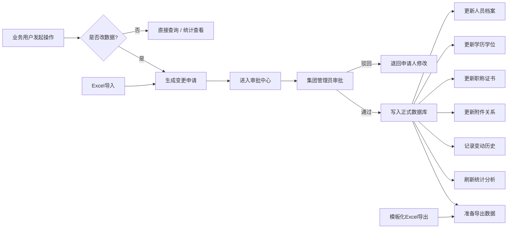
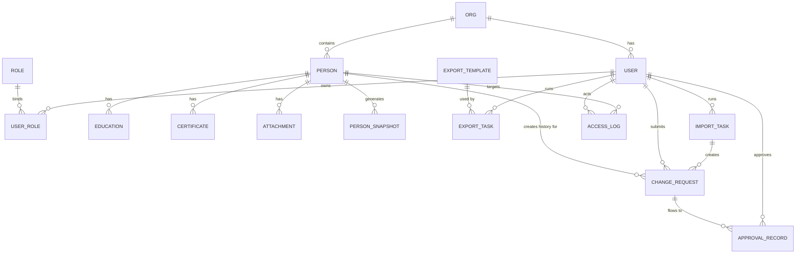

# HR系统设计说明

## 1. 项目定位

本项目建设为一套部署在公司内网环境中的 `Web HR 系统`，用于替代当前以多个 Excel 台账为核心的人力管理方式，实现统一的数据管理、权限控制、审批留痕、附件纳管、统计分析，以及与现有 Excel 体系的高保真导入导出。

当前已确认强关联的历史文件包括：

- `土投集团人员台账(4).xlsx`
- `学历学位证书台账(1).xlsx`
- `数据汇总(2).xlsx`

系统目标不是继续以 Excel 作为主业务载体，而是以 `数据库作为唯一真实数据源`，保留 Excel 作为导入来源和 1:1 导出模板。

## 2. 已确认范围

### 2.1 部署方式

- 内网统一部署
- 多人联机使用
- 当前优先支持电脑端浏览器

### 2.2 权限与审批

- 登录方式：先使用系统内账号密码
- 权限模型：`角色 + 数据范围`
- 审批模式：`单级审批`
- 审批范围：除查询外，所有改数据操作默认进入审批

### 2.3 Excel 相关要求

- 必须支持现有 Excel 模板导入
- 导出需尽量实现 `1:1 高保真`
- 正式导出基准采用 `正式在用、带超链接` 的 Excel 版本
- 后续需支持 `自定义导出模板配置`

### 2.4 附件管理要求

- 学历证书、学位证书、职称证书、其他证书扫描件纳入系统
- 支持上传、预览、下载
- 附件访问需受权限控制
- 附件下载需采用更严格控制策略，至少预留下载审计、下载权限细分能力

## 3. 模块设计

为避免重复建设，功能按业务域合并为 `5 个主模块`。

### 3.1 人员档案中心

用于管理“人”的完整档案信息，是系统主工作台。

包含内容：

- 人员主档案
- 学历学位
- 职称证书
- 附件管理
- 人员变动
- 人员画像

页面建议：

- 人员列表页
- 人员详情页
- 新增/编辑人员页
- 学历学位编辑弹窗
- 职称证书编辑弹窗
- 附件管理弹窗
- 人员变动记录页
- 人员画像页

人员详情页建议采用 Tab 结构：

- 基本信息
- 学历学位
- 职称证书
- 附件
- 人员变动
- 人员画像

### 3.2 审批中心

用于承接所有改数据操作的生效流程。

包含内容：

- 待我提交
- 待我审批
- 我发起的申请
- 已审批记录
- 审批详情对比
- 审批日志

审批中心统一承接以下类型的申请：

- 人员主档案新增/修改/删除
- 学历学位变更
- 职称证书变更
- 附件变更
- 导入产生的批量变更

### 3.3 数据中心

统一管理与 Excel 交互的能力，以及模板能力。

包含内容：

- Excel 导入
- 导入结果校验
- Excel 导出
- 导出记录
- 1:1 模板导出
- 模板管理
- 模板配置
- 模板测试导出

### 3.4 统计分析中心

用于 BI 统计、汇总分析、趋势观察，不承担数据编辑职责。

包含内容：

- 统计首页
- 层级汇总
- 人员结构汇总
- 学历统计
- 证书统计
- 人员变动分析

### 3.5 系统设置

用于系统级配置与权限治理。

包含内容：

- 用户管理
- 角色权限
- 数据范围配置
- 组织架构
- 系统参数
- 操作日志

说明：

- 组织架构仅允许系统管理员维护
- 业务侧用户不可直接修改组织架构

## 4. 三个 Excel 的系统映射关系

### 4.1 土投集团人员台账(4)

对应系统中的：

- 人员主档案
- 在职/离职状态
- 层级汇总
- 人员结构汇总

说明：

- `数据` Sheet 作为在职人员主台账基线
- `离职人员` Sheet 作为离职档案历史来源
- `层级汇总`、`人员结构汇总` 是统计输出模板，不作为主数据维护入口

### 4.2 学历学位证书台账(1)

对应系统中的：

- 学历学位记录
- 学历证书附件
- 学位证书附件

说明：

- 按公司分 Sheet 的结构，在系统中应还原为“统一记录 + 组织归属”
- 一个人允许存在多条教育经历

### 4.3 数据汇总(2)

对应系统中的：

- 职称证书记录
- 其他证书记录
- 年度证书统计

说明：

- `总` Sheet 是统计页
- `职称证书`、`其他证书` 是业务明细
- 后续 BI 页面和导出报表应能复刻这一套逻辑

## 5. 核心业务边界

### 5.1 人员主档案

仅管理人员当前有效状态，例如：

- 姓名
- 性别
- 民族
- 籍贯
- 政治面貌
- 公司
- 部门
- 职务
- 入职时间
- 当前层级
- 在职/离职状态
- 档案位置

### 5.2 学历学位

单独管理一对多教育经历，例如：

- 学历类型
- 学位
- 毕业院校
- 专业
- 毕业时间
- 学历证书
- 学位证书

### 5.3 职称证书

单独管理一对多证书经历，例如：

- 职称证书
- 技能证书
- 职业资格证书
- 其他证书
- 取得时间
- 证书附件

### 5.4 人员变动

负责承载所有会改变人员状态的数据事件，例如：

- 新增
- 修改
- 删除
- 调岗
- 调部门
- 离职
- 附件变更

### 5.5 人员画像

人员画像不作为人工录入表，而应由以下数据自动形成：

- 主档案当前状态
- 学历变化
- 证书变化
- 历史变动记录
- 审批通过后的时间轴

## 6. 页面结构图

```mermaid
flowchart TB
    A["首页 / 工作台"]

    A --> B["人员档案中心"]
    A --> C["审批中心"]
    A --> D["数据中心"]
    A --> E["统计分析中心"]
    A --> F["系统设置"]

    B --> B1["人员列表页"]
    B --> B2["人员详情页"]
    B --> B3["新增/编辑人员"]
    B --> B4["学历学位编辑"]
    B --> B5["职称证书编辑"]
    B --> B6["附件管理"]
    B --> B7["人员变动记录"]
    B --> B8["人员画像"]

    C --> C1["待我提交"]
    C --> C2["待我审批"]
    C --> C3["我发起的申请"]
    C --> C4["已审批记录"]
    C --> C5["审批详情对比"]

    D --> D1["导入页"]
    D --> D2["导入结果页"]
    D --> D3["导出页"]
    D --> D4["导出记录页"]
    D --> D5["模板管理页"]
    D --> D6["模板配置页"]
    D --> D7["模板测试导出"]

    E --> E1["统计首页"]
    E --> E2["层级汇总"]
    E --> E3["人员结构汇总"]
    E --> E4["学历统计"]
    E --> E5["证书统计"]
    E --> E6["人员变动分析"]

    F --> F1["用户管理"]
    F --> F2["角色权限"]
    F --> F3["数据范围配置"]
    F --> F4["组织架构"]
    F --> F5["系统参数"]
    F --> F6["操作日志"]
```

## 7. 业务流程图

## 8. 核心数据关系图

## 9. 约束条件

### 9.1 技术约束

- 系统定位为 `内网 Web 系统`，不再按桌面端方案设计
- 生产环境不建议使用 SQLite 作为正式主库
- 正式部署数据库确定为 `MySQL`
- 系统应支持后续扩展统一认证接口，但当前一期可先用本地账号体系

### 9.2 权限约束

- 权限控制必须按 `角色 + 数据范围` 实现
- 单位管理员默认仅能查看和维护本单位数据
- 集团管理员可处理全集团审批
- 附件访问不得默认开放，必须纳入权限控制
- 附件下载必须单独授权，不得默认继承普通查看权限
- 下载、审批、导入、导出等关键动作必须留痕
- 组织架构仅允许系统管理员维护，普通业务角色和单位管理员不得直接修改

### 9.3 审批约束

- 除查询外，所有改数据操作不得直接生效
- 所有变更必须先形成申请单，再进入审批
- 审批通过后才写入正式数据
- 驳回后保留申请记录，不得直接覆盖历史

### 9.4 Excel 约束

- 现有 Excel 模板是业务迁移的重要基线，不允许脱离模板结构随意输出
- 最终导出基准采用正式在用、带超链接的 Excel 模板版本
- 一期必须优先保障 `1:1 导出能力`
- Excel 导出必须保留：
  - Sheet 结构
  - 列顺序
  - 样式
  - 合并单元格
  - 行高列宽
  - 公式兼容性
  - 超链接逻辑
  - 附件引用逻辑
- Excel 模板编辑功能一期不做在线 Excel 编辑器，优先做：
  - 模板上传
  - 字段映射
  - 模板配置
  - 测试导出

### 9.5 数据约束

- 数据库是唯一真实数据源
- Excel 不再作为最终主数据源
- 人员主档案、学历、证书、附件、变动必须解耦存储
- 人员画像必须由数据自动生成，不允许人工直接维护画像结果

### 9.6 BI 约束

- BI 模块只负责展示和分析，不负责修改主数据
- BI 统计口径需与历史 Excel 汇总口径保持一致
- 统计结果必须可追溯到明细来源

### 9.7 附件安全约束

- 附件下载必须纳入更严格的安全控制策略
- 系统至少应支持下载日志审计
- 系统应预留更严格的后续能力，例如水印、下载限制、按角色差异化控制

## 10. 推荐实施顺序

### 第一期

- 人员档案中心
- 审批中心
- 系统设置
- 基础导入能力

### 第二期

- 高保真 Excel 导出
- 模板管理
- 学历/证书附件纳管

### 第三期

- BI 统计
- 人员画像
- 更完整的导入导出与模板配置能力

## 11. 当前仍待确认事项

- 人员离职、调岗、借阅等业务是否还会扩展更细的审批意见字段
